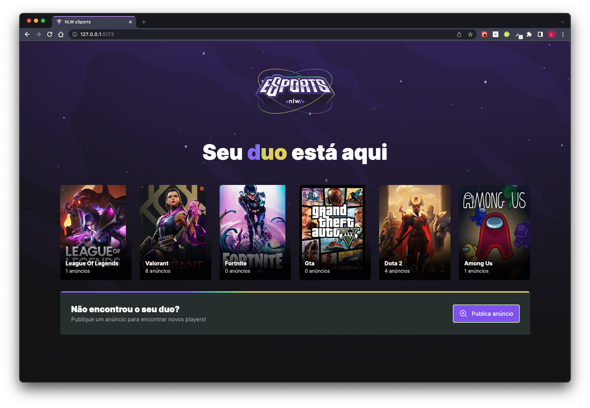
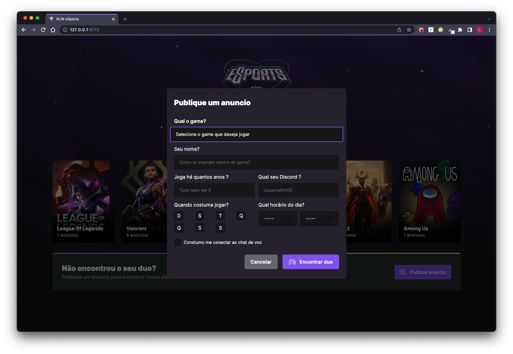

<h1 align="center">
  Esports
</h1>

## 💻 Project

This project is a challenge

## 🚀 Technology

### FrontEnd

  - HTML
  - JavaScript
  - React JS
  - Vite
  - Tailwind
  - radix-ui

### Backend

  - Node
  - Prisma
  - Express
  - zod

---
## 🚀 Install Esports
  
  Requirements:
  ```
  1. Node V16
  2. npm or yarn
  ```
---
## ☕ Running
  Backend:
  ```
  1. cd backend
  2. npm install
  3. npm run dev
  ```
  FrontEnd:
  ```
  1. cd web
  2. npm install
  3. npm run dev
  ```
---
## 📺 Web
<table>
  <tr>
    <td valign="top"></td>
  </tr>
  <tr>
    <td valign="top"></td>
  </tr>
</table>


